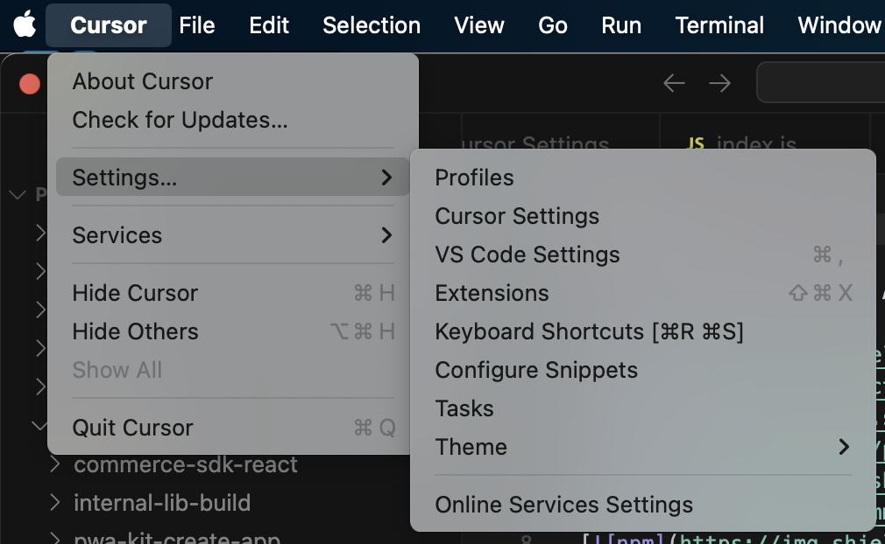
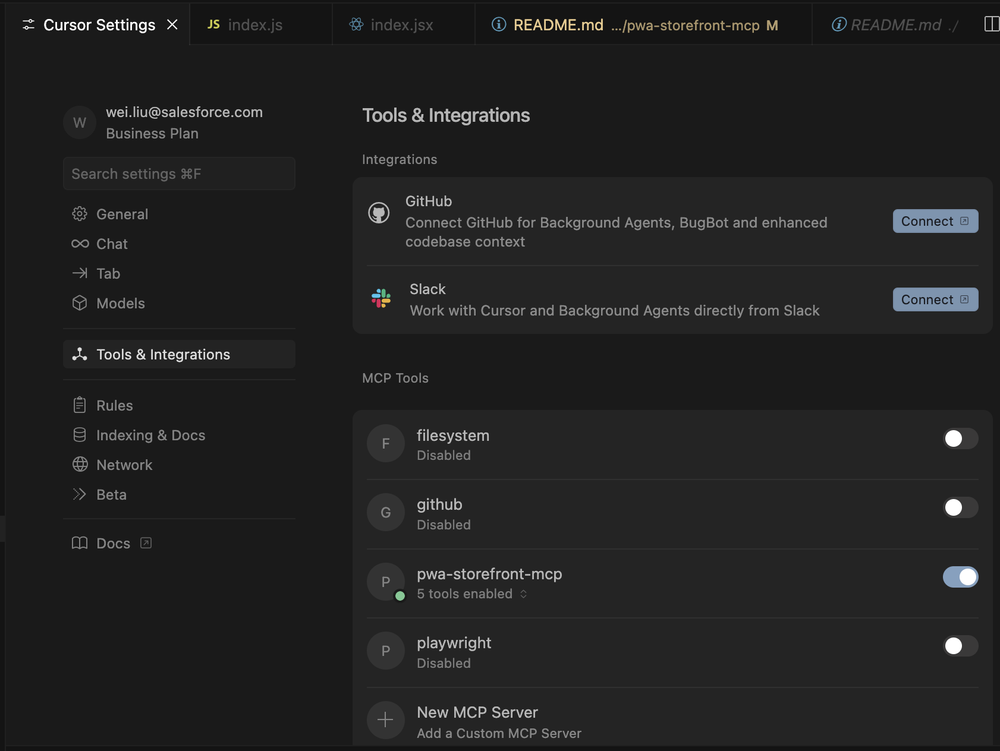

# PWA Storefront MCP Server

An Model Context Protocol (MCP) server that helps PWA Storefront developers with development.

## What is MCP?

The Model Context Protocol (MCP) is an open protocol that enables secure connections between host applications (like Claude Desktop or other AI assistants) and external data sources and tools.

## Features

This MCP server provides:
- `development_guidelines`: Help developers to understand and follow PWA Storefront developer guidelines and best practices
- `create_new_component`: Help developers to create a new PWA Storefront component
- `submit_pwa_kit_project_answers`: Help developers to generate a new PWA Storefront project

## Setup

1. Install dependencies:
```bash
npm install
```

## Run the MCP Server

### Method 1: Run MCP Server From Cursor
Open Cursor Application
Go to Cursor Menu on top menu bar, then *Settings* > *Cursor Settings...* > Tools & Integrations > MCP Tools > New MCP Server




Add this to your mcp.json:
``` json
{
  "mcpServers": {

    "pwa-storefront-mcp": {
      "command": "node /Users/wei.liu/dev/git-repos/pwa-kit-2/pwa-kit/packages/pwa-storefront-mcp/src/server/server.js",
      "transport": "stdio",
      "args": []
    }
  }
}

This will:
- Start the MCP server
- Connect to it as a client
- List available tools
- Call the `create_new_component` tool
- Display the results

This will:
- Start the MCP server
- Connect to it as a client
- List available tools
- Call the `create_new_component` tool
- Display the results

### Method 2: Manual testing with MCP clients

#### Using Claude Desktop
1. Add this server to your Claude Desktop configuration:
```json
{
  "mcpServers": {
    "pwa-storefront-server": {
      "command": "node",
      "args": ["server.js"],
      "cwd": "{{$parent_dir_to_mcp}}/pwa-storefront-mcp"
    }
  }
}
```

#### Using other MCP clients
The server runs on stdio, so you can test it with any MCP-compatible client.

### Method 3: Direct stdio testing

You can also test directly by running the server and sending JSON-RPC messages:

```bash
# Start the server
node server.js

# Then send JSON-RPC requests to stdin:
{"jsonrpc": "2.0", "id": 1, "method": "tools/list", "params": {}}
{"jsonrpc": "2.0", "id": 2, "method": "tools/call", "params": {"name": "create_new_component", "arguments": {}}}
```

## Files

- `server.js` - Main MCP server implementation
- `test-mcp.js` - Automated test script
- `mcp.json` - MCP configuration file for clients
- `package.json` - Node.js dependencies and scripts

## Development

To run the server in development mode:
```bash
npm start
```

The server will output debug information to stderr and handle MCP protocol messages via stdio.

# Project Structure

```
/ (root)
  - package.json
  - package-lock.json
  - README.md
  - mcp.json
  - claude_desktop_config.json
  /src
    /components
      - index.js
      - PrimaryButton.jsx
      ... (other components)
    /server
      - server.js
      - server-old-fashioned.js
    /utils
      - AddComponentTool.js
    /scripts
      - create-button.js
      - demo.js
    /tests
      - test-mcp.js
  /docs
    - cursor-integration-guide.md
  /node_modules
  /.cursor
```

- All React components are in `src/components/`.
- Server code is in `src/server/`.
- Utilities/tools are in `src/utils/`.
- Scripts are in `src/scripts/`.
- Tests are in `src/tests/`.
- Documentation is in `docs/`.

Update your import paths accordingly. 